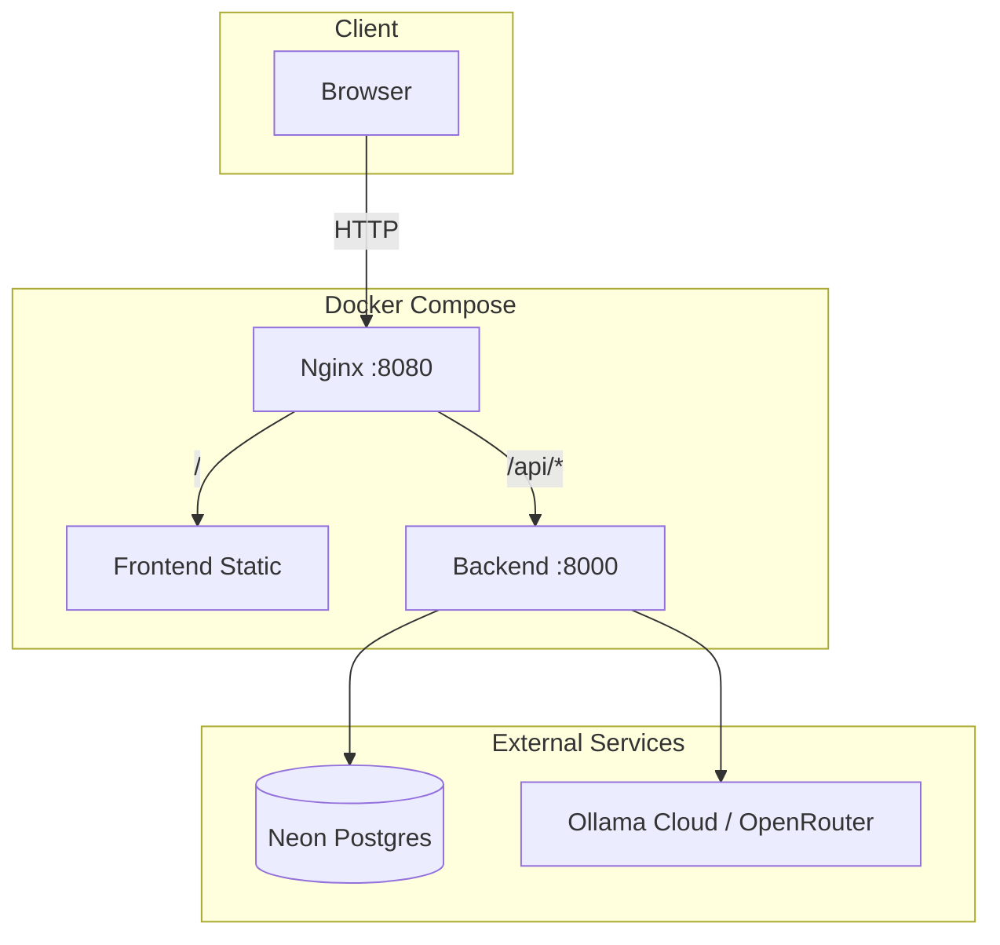
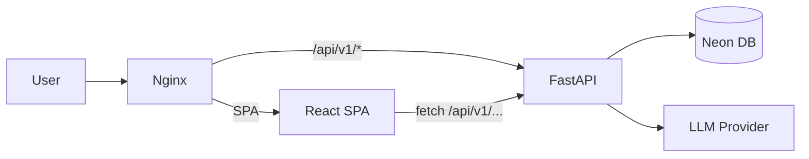
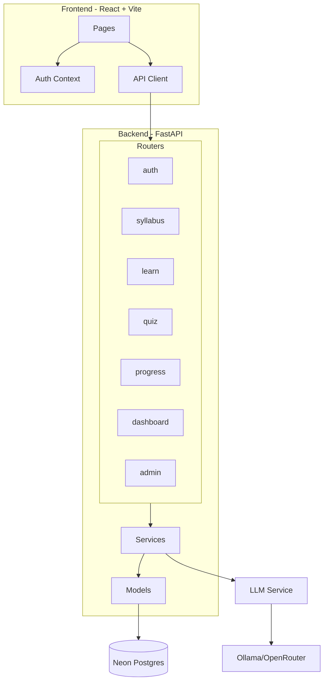
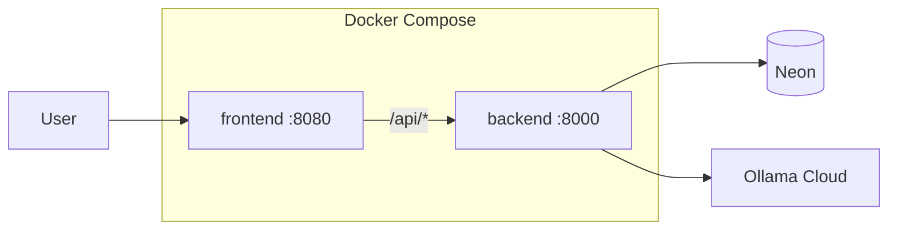
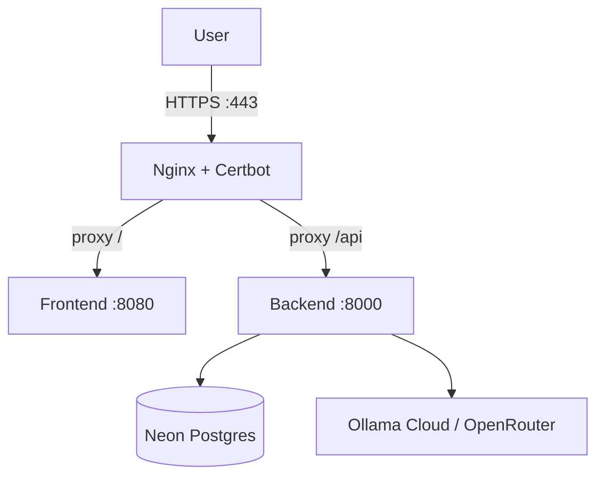

# StudyAI – Intelligent Learning Platform

AI-powered education platform for AI & Machine Learning topics. Browse structured, generate lessons with LLMs, take quizzes, and track progress.

---

## About This Project

**StudyAI** is a full-stack web application that helps learners master AI and ML concepts through:

- **Structured Syllabus** – Pre-loaded AI/ML curriculum with units, topics, and sub-topics
- **AI Lesson Generation** – Generate explanations, code examples, and key points using LLMs (Ollama Cloud, OpenRouter)
- **Interactive Quizzes** – Auto-generated quizzes to test understanding
- **Progress Tracking** – Per-topic progress and dashboard analytics
- **Admin Dashboard** – User and content management
- **Authentication** – JWT-based auth with register, login, forgot/reset password

---

## Tech Stack

### Frontend
| Technology | Version | Purpose |
|------------|---------|---------|
| React | 18.x | UI framework |
| TypeScript | 5.x | Type safety |
| Vite | 5.x | Build tool & dev server |
| React Router | 6.x | Client-side routing |
| TanStack Query | 5.x | Server state & caching |
| React Hook Form + Zod | 7.x / 3.x | Forms & validation |
| Tailwind CSS | 3.x | Styling |
| React Markdown + KaTeX | 9.x | Rich content, math |
| Axios | 1.x | HTTP client |
| Lucide React | 0.29x | Icons |

### Backend
| Technology | Version | Purpose |
|------------|---------|---------|
| Python | 3.11 | Runtime |
| FastAPI | 0.115.x | API framework |
| Uvicorn | 0.34.x | ASGI server |
| SQLAlchemy | 2.0.x | ORM (async) |
| AsyncPG | 0.30.x | PostgreSQL driver |
| Pydantic | 2.10.x | Settings & schemas |
| LangChain + LangChain-OpenAI | 0.3.x | LLM orchestration |
| PyJWT + bcrypt | 2.9 / 4.2 | Auth |
| Pandas | 2.2.x | CSV processing |
| SSE-Starlette | 2.2.x | Streaming responses |

### Database
| Technology | Purpose |
|------------|---------|
| Neon Postgres | Serverless PostgreSQL (cloud) |

### LLM Providers (configurable)
| Provider | Use Case |
|----------|----------|
| Ollama Cloud | `gpt-oss:120b-cloud` – no local GPU needed |
| OpenRouter | Alternative cloud LLM API |
| Local Ollama | Self-hosted (Docker optional) |

### DevOps & Deployment
| Technology | Purpose |
|------------|---------|
| Docker | Containerization |
| Docker Compose | Multi-container orchestration |
| Nginx | Static files + API reverse proxy |
| Hostinger VPS | Production hosting (optional) |

---

## Architecture

### High-Level Overview



### Request Flow



### Component Diagram



---

## Deployment Strategy

### Option 1: Local Development

```bash
# Backend (from project root)
cd backend && pip install -r requirements.txt && uvicorn app.main:app --reload --port 8001

# Frontend
cd frontend && npm install && npm run dev
# Access at http://localhost:5173
```

### Option 2: Docker (Recommended for Testing / Production)

```bash
# Build and run
docker compose up -d --build

# Access at http://localhost:8080
```

**Docker Architecture:**



### Option 3: VPS Deployment (Hostinger / Ubuntu)

#### Prerequisites
- Hostinger VPS (Ubuntu 24.04 + Docker)
- Domain A record pointing to VPS IP

#### Steps

1. **SSH into VPS** and install nginx + certbot (for HTTPS):
   ```bash
   sudo apt update
   sudo apt install nginx certbot python3-certbot-nginx -y
   ```

2. **Get SSL certificate:**
   ```bash
   sudo certbot --nginx -d yourdomain.com
   ```

3. **Clone and configure:**
   ```bash
   git clone https://github.com/your-username/studyai.git
   cd studyai
   cp .env.example .env
   # Edit .env: neon_db_api_key, JWT_SECRET_KEY, OLLAMA_* or OPENROUTER_*
   ```

4. **Run with Docker:**
   ```bash
   docker compose up -d --build
   ```

5. **Configure nginx** to proxy to Docker (e.g. `/` → `http://127.0.0.1:8080`, `/api` → `http://127.0.0.1:8000`).

6. **Firewall:**
   ```bash
   sudo ufw allow 80,443/tcp && sudo ufw enable
   ```

#### VPS Architecture



---

## Quick Start (Docker)

1. **Clone the repository:**
   ```bash
   git clone https://github.com/your-username/studyai.git
   cd studyai
   ```

2. **Create `.env`** from `.env.example`:
   ```bash
   cp .env.example .env
   ```

3. **Configure required variables:**
   ```env
   neon_db_api_key=postgresql://...
   JWT_SECRET_KEY=your-secret-key
   LLM_PROVIDER=ollama
   OLLAMA_BASE_URL=https://ollama.com
   OLLAMA_MODEL=gpt-oss:120b-cloud
   OLLAMA_API_KEY=your-ollama-api-key
   ```

4. **Run:**
   ```bash
   docker compose up -d --build
   ```

5. **Open** [http://localhost:8080](http://localhost:8080)

---

## Environment Variables

| Variable | Required | Description |
|----------|----------|-------------|
| `neon_db_api_key` | Yes | Neon Postgres connection string |
| `JWT_SECRET_KEY` | Yes | Secret for JWT signing |
| `LLM_PROVIDER` | Yes | `ollama` \| `openrouter` |
| `OLLAMA_BASE_URL` | If ollama | `https://ollama.com` (Cloud) or `http://localhost:11434` |
| `OLLAMA_MODEL` | If ollama | e.g. `gpt-oss:120b-cloud` |
| `OLLAMA_API_KEY` | If ollama Cloud | From [ollama.com/settings/keys](https://ollama.com/settings/keys) |
| `OPENROUTER_API_KEY` | If openrouter | From OpenRouter |
| `OPENROUTER_MODEL` | If openrouter | Model ID |
| `DEV_AUTO_LOGIN_ENABLED` | No | Set `false` in production |

See `.env.example` for full list.

---

## Project Structure

```
├── backend/
│   ├── app/
│   │   ├── routers/     # API routes (auth, learn, quiz, etc.)
│   │   ├── services/    # Business logic, LLM orchestration
│   │   ├── models/      # SQLAlchemy models
│   │   ├── schemas/     # Pydantic schemas
│   │   └── utils/       # JWT, CSV loader
│   ├── Dockerfile
│   └── requirements.txt
├── frontend/
│   ├── src/
│   │   ├── components/
│   │   ├── pages/
│   │   ├── services/
│   │   └── contexts/
│   ├── Dockerfile
│   ├── nginx.conf
│   └── package.json
├── docker-compose.yml
├── .env.example
└── AI_ML_Syllabus_Structured.csv
```

---

## API Documentation

- **Swagger UI:** `http://localhost:8080/api/v1/docs` (when proxied) or `http://localhost:8000/docs`
- **ReDoc:** `http://localhost:8000/redoc`
- **Health:** `GET /api/v1/health`

---

## License

MIT
